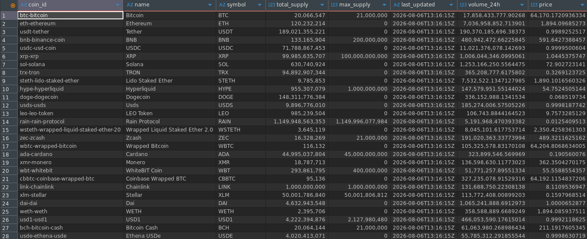

# Binance Crypto Data ETL
## Contents
1. [Project Overview](#project-overview)
2. [Tech Stack](#tech-stack)
3. [Project Structure](#project-structure)
4. [Environment Setup](#environment-setup)
5. [Architecture](#architecture)
6. [Running the Pipeline](#running-the-pipeline)

## Project Overview
This project provides an ETL pipeline that extracts crypto price data from the [binance REST API](https://developers.binance.com/en/docs/catalog/core-trading-spot-trading/api/rest-api/general), transforms the data, and loads it into a postgres database.

## Tech Stack
- Python
- PostgreSQL
- SQLalchemy
- Psycopg2
- Pandas
- Binance API
- uv by Astral

## Project Structure
```text
binance_crypto_etl
├── README.md           #Project documentation
├── config.py           #Environment configuration details
├── etl                
│   ├── __init__.py     #Package initialization
│   ├── extract.py      #Extraction logic
│   ├── load.py         #Database logic
│   └── transform.py    #Data transformation logic
├── main.py             #ETL synchronization / project entrypoint
├── pyproject.toml      #General project dependecies
└── uv.lock             #Specific project dependencies
```
## Environment Setup
1. **Cloning**

Clone the repository and switch to the repository root folder
```bash
$ git clone <repository url>
$ cd binance_crypto_etl
````
2. **Configuration**

Create a .env file and replace the placeholder details inside [.env.example](.env.example)
```bash
$ touch .env
```
3. **Dependency syncronization**

The project dependecies are managed using [uv](https://docs.astral.sh/uv/). Inside the project root folder run `uv sync` to synchronize all the dependencies provided in [uv.lock](uv.lock) to your local environment.
```bash
$ ~/binance_crypto_etl$ uv sync
```
## Architecture
There are 3 main components used in this project:
1. Extract
2. Transform
3. Load
### Extract
This module's aim is to consume the binance API data and make it available to the pipeline. It does so by employing the `requests` python package.
Since the data been extracted is market data and hence not highly sensitive, Binance does not require an API key or token to use the API.
### Transform
Here, the raw data that was obtained from the API in the extract module is cleaned and arranged in a coherent manner. `Pandas` is the main tool used to carry out the data manipulation.
### Load
After the data is cleaned and transformed, it is then loaded to the postgres database using pandas `.to_sql()` function.

__**Note:**__ The defined postgres database should be running.

This module uses `sqlalchemy` and the `psycopg2 driver` to provide the connection to the DB.

__**General Architecture:**__
```text
   --- 
  |API|
   ---
    ⬇
Extract
    ⬇
Transform
    ⬇
   Load
    ⬇
 --------    
|Database|
 --------
```
## Running the Pipeline
All the aforementioned processed are synchronized inside the [main.py](main.py) file, which serves as the project's entry point.
To run the project run the command below:
```bash
$ uv run python -m main
```
This will spawn the ETL and upload the data to the postgres database.
<figure>

<figcaption><i>crypto table</></figcaption>
</figure>
